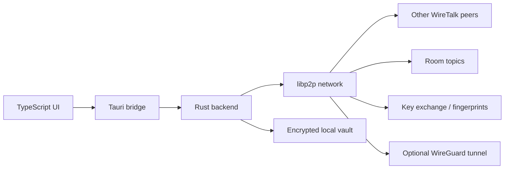

# WireTalk

WireTalk is a desktop, peer-to-peer chat application built with Tauri, Rust, and TypeScript. It is designed for private communication inside user-controlled networks rather than through a central chat server.

Peers connect through libp2p, discover each other on local networks with mDNS, exchange room invitations, and can route traffic over WireGuard when peers are on different networks. Messages can be encrypted end-to-end, and the app stores local state in an encrypted vault.

## What It Does

- Peer-to-peer chat with no central message server.
- Room-based messaging so conversations stay isolated.
- End-to-end encryption using per-peer key exchange and AES-256-GCM.
- Identity fingerprints to help verify who you are talking to.
- Encrypted local storage for messages, rooms, user state, and keys.
- Optional WireGuard support for cross-network connectivity.

## Requirements

- Node.js 18+.
- Rust toolchain with `cargo` and `rustup`.
- A Tauri-compatible desktop environment.
- On Linux, the system packages required by Tauri 2 and WebKitGTK for your distribution.

If you are on Linux and Tauri setup fails, install the missing GTK/WebKit development packages for your distro and try again. The exact package names vary between Debian, Fedora, Arch, and others.

## Installation

1. Clone the repository.
2. Install the JavaScript dependencies with `npm install`.
3. Make sure Rust toolchain is installed
4. Install any missing Linux desktop dependencies required by Tauri.

## Run Locally

Start the desktop app in development mode:

```bash
npm run tauri -- dev
```

Build the frontend only:

```bash
npm run build
```

Build a desktop bundle:

```bash
npm run tauri -- build
```

## How It Works



The app is split into two layers:

- The frontend handles the UI, room controls, encryption toggles, and user actions.
- The Rust backend manages networking, identity, encryption, secure storage, and WireGuard integration.

At a high level:

1. The UI sends commands into the Tauri backend.
2. The Rust P2P layer publishes messages to libp2p gossip topics.
3. Room messages stay isolated by room topic.
4. Key exchange messages establish peer identities and shared secrets.
5. Messages are encrypted before transport when E2EE is enabled.
6. Local app state is written to an encrypted vault on disk.

## Security Notes

WireTalk is built with privacy in mind, but it is still an active project rather than a formally audited messenger.

- Encryption is handled on the client side.
- The serverless design reduces exposure to a central message relay.
- Peer fingerprints are used to help detect impersonation.
- Room invitations and key exchange still rely on users trusting the peer they accept.

## Project Layout

- `src/` contains the TypeScript frontend.
- `src-tauri/src/` contains the Rust backend, networking, encryption, and storage logic.
- `src-tauri/tauri.conf.json` defines the Tauri app configuration and build hooks.

## Development

The frontend is built with Vite, and the native app is handled by Tauri

- `npm run tauri -- dev` starts the app in development mode.
- `npm run build` compiles the frontend.
- `npm run tauri -- build` packages the desktop application.
